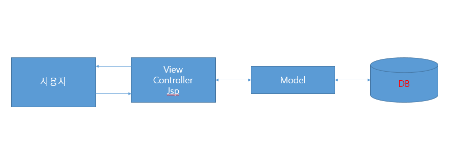

# : 농심몰 홈페이지

## : 프로젝트 개요
"농심몰" 이라는 웹 사이트를 주제로 MVC_Level1을 사용하여 백엔드를 구현, 프론트엔드 부분을 프로토타입, 스토리보드, 메뉴구조도를 활용하여 계획을 하고, HTML, CSS, JAVASCRIPT, JQUERY, Bootstrap를 사용해 구현 , 구현 한 기능으로는 회원가입, 아이디 중복체크, 주소 검색 ,로그인, 회원 상세보기 ,회원 정보 수정, 회원 탈퇴, 게시판 글 작성, 게시판 상세보기, 게시판 글 수정, 게시판 글 삭제, 이미지를 이용한 제품 등록, 제품 상세보기, 제품 수정, 제품 삭제, 제품 구매, 제품 결제 기능, Q&A 글 작성, Q&A 상세보기, Q&A 수정, Q&A 삭제를 구현 하였음

## :clipboard: 개발환경
* Eclipse
* GitHub

## :clipboard: 사용 기술
### 백엔드
#### MVC_Level1
* JAVA 8
* SHA-256

#### Database
* Mysql

#### Server
* Apache Tomcat8

### 프론트엔드
* Bootstrap

## :clipboard: 주요 키워드
* 예외처리
* Git 버전관리
* 트랜잭션 처리

## 프로젝트 설계

### 백엔드 구현 로직(MVC1)

### 데이터베이스 구조도(ERD)

### 메뉴 구조도

### UI 프로세스

## 기능 구현 화면

